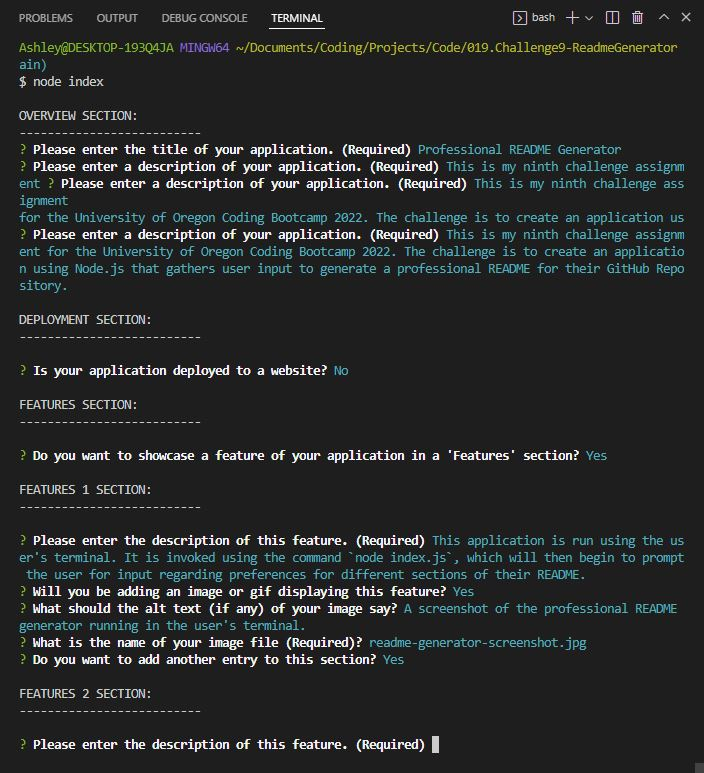
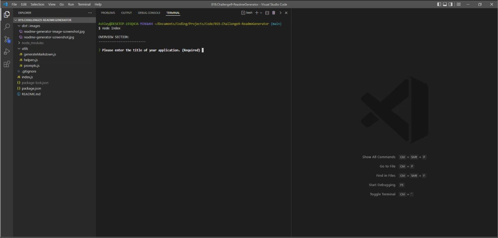
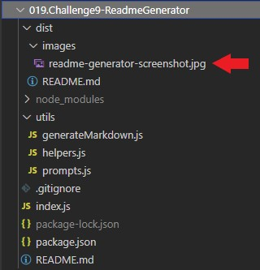

# Professional README Generator

## Table-of-Contents

- [Description](#description)

- [Features](#features)
- [Installation](#installation)
- [Technologies](#technologies)
- [Future Development](#future-development)
- [Credits](#credits)

## Description

This is my ninth challenge assignment for the University of Oregon Coding Bootcamp 2022. The challenge is to create an application using Node.js that gathers user input to generate a professional README for their GitHub Repository.

## Features

This application is run using the user's terminal. It is invoked using the command `node index.js`, which will then begin to prompt the user for input regarding preferences for different sections of their README.

For the README file to be generated, users must follow the prompts in the command line interface. This provides the application with information regarding their project, which will then be used to generate the README file. Once completed with the prompts, a markdown file will generate in `dist/README.md`.

 (Click the thumbnail above or this <a href="https://drive.google.com/file/d/1sM7Iofh1z9Sq8Fl-C-DVO_5obSD6HvQg/view" target="_blank">link</a> to view the demonstration video on YouTube.)

If users wish to include any pictures or gifs in their project, they need to specify the name of the image or gif file when prompted by the terminal questions. Once the markdown is generated, users will need to add their image files to the `dist/images/` directory, ensuring that the file name of their image matches what they entered in the prompts. It is also important to note that you must use single quotes instead of double quotes in the image section.

## Installation

1. Open the command line interface.
2. Clone the repository onto your local machine using the `git clone` command.
3. Once the repository has been cloned, navigate into the root direcotry of the application using the command `cd Readme-Generator`.
4. Run the command npm install to install necessary packages and dependencies.
5. Once the dependencies have been properly installed, enter the command `node index.js` to initiate the application.
6. Navigate through the prompts in your command line interface using your keyboard.
7. If you entered "y" to any of the prompts regarding adding images or gifs to your readme, you will need to manually add those image files to `dist/images/`, ensuring that the name of the image entered in the prompts matches the name of the image file.
8. Once completed, your README will generate automatically with the information you entered. Open `dist/README.md` to see your generated README file.

## Technologies

- JavaScript
- Node.js
- npm

## Future Development

In the future, I would like to add the following improvements:

- I would like to somehow add a more streamlined way of adding image or gif files to the project rather than the user having to manually add their images to the `dist/images/` directory every time.

I'm always interested in refactoring code to improve it's functionality. If you would like to suggest your own improvements, you can reach our development team at the links below.

- <a href="mailto:ashlynn4567@gmail.com">Email</a>
- <a href="https://github.com/ashlynn4567">GitHub</a>
- <a href="www.linkedin.com/in/Ashley-Lynn-Smith">LinkedIn</a>

## Credits

This project was built with the help of the University of Oregon's Coding Boot Camp.

## Licensing

The application is covered under the following license: [MIT](https://opensource.org/licenses/MIT)
